# Чек-листы ads.vk.com

## Личный кабинет - физическое лицо

1. Тестирование (навигационного) меню:
   * При успешной авторизации в аккаунт, происходит переход на URL: https://ads.vk.com/hq/overview и открывается следующее меню: 
   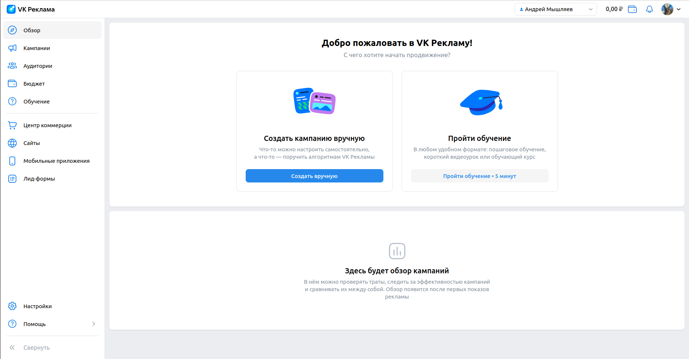

   * При нажатии на иконку "VK Реклама", происходит переход на URL: https://ads.vk.com/hq/overview и открывается следующее меню: 
   
   
   * При нажатии на кнопку "Помощь", появляется дропбокс следующего содержания: "Кейсы компаний", "Справка", "Форум идей", "Задать вопрос". 
   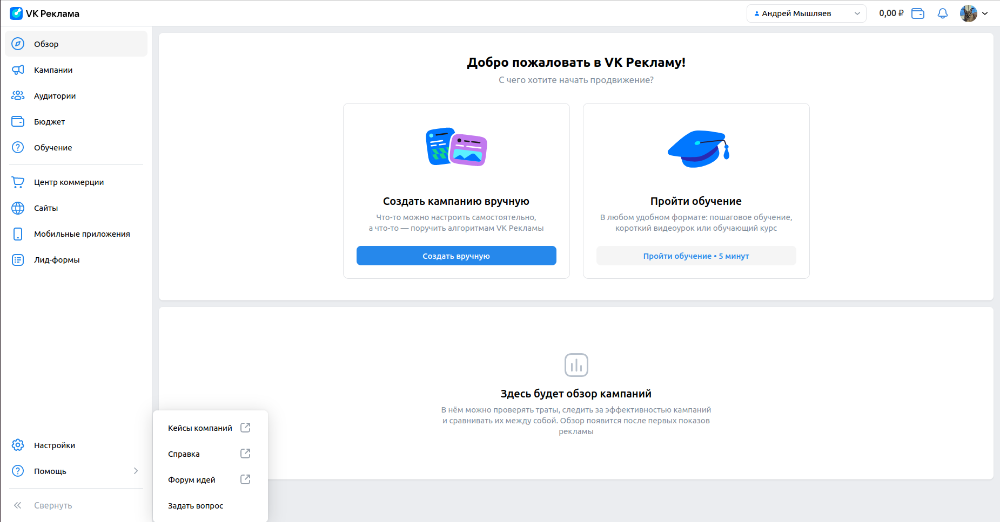

     * При нажатии на кнопку "Кейсы компаний" открывается страница https://ads.vk.com/cases
     * При нажатии на кнопку "Справка" открывается страница со справкой https://ads.vk.com/help
     * При нажатии на кнопку "Форум идей" открывается страница форума идей https://ads.vk.com/upvote
     * При нажатии на кнопку "Задать вопрос" открывается окно с чатом

   * При нажатии кнопки "Настройки", происходит переход на URL: https://ads.vk.com/hq/settings и открывается следующее меню: 
   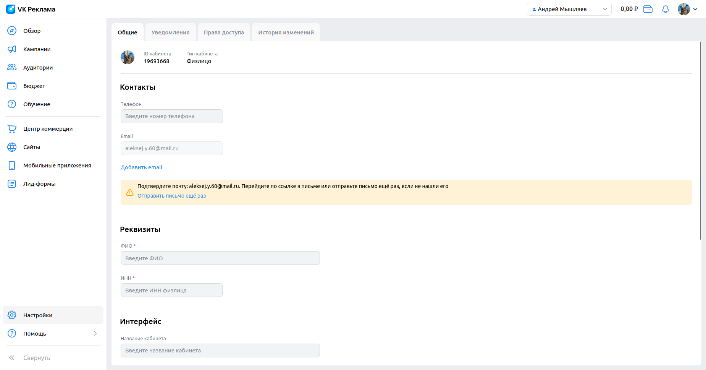

       * При нажатии на вкладку "Уведомления" открывается страница уведомлений https://ads.vk.com/hq/settings/notifications
       * При нажатии на кнопку "Права доступа" открывается страница прав https://ads.vk.com/hq/settings/access
       * При нажатии на кнопку "История изменений" открывается страница логов https://ads.vk.com/hq/settings/logs

   * При нажатии на иконку пользователя происходит вызов следующего дропбокс меню, которое содержит имя пользователя с подпунктом "Управление VK ID", "Выйти": 
   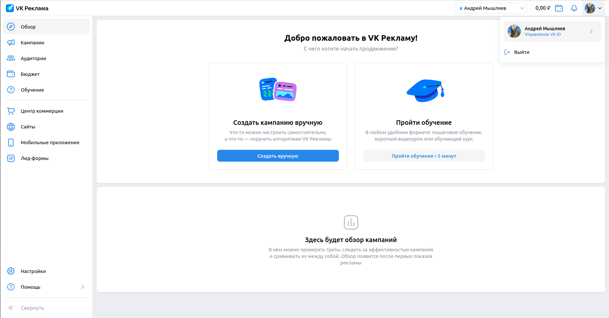
 
     * При нажатии на кнопку "Управление VK ID" происходит перенаправление на URL: https://id.vk.com/account/#/main
     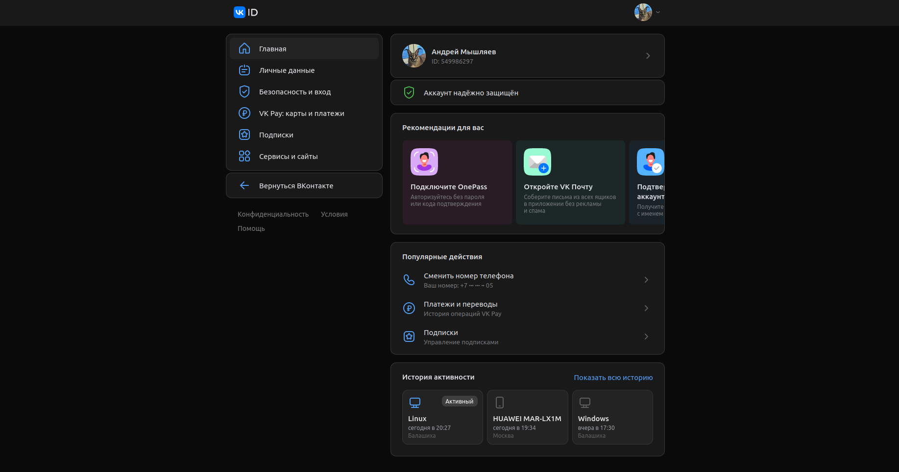
     
     * При нажатии на кнопку "Выйти" происходит выход из учетной записи и перенаправление на URL:https://ads.vk.com. 
     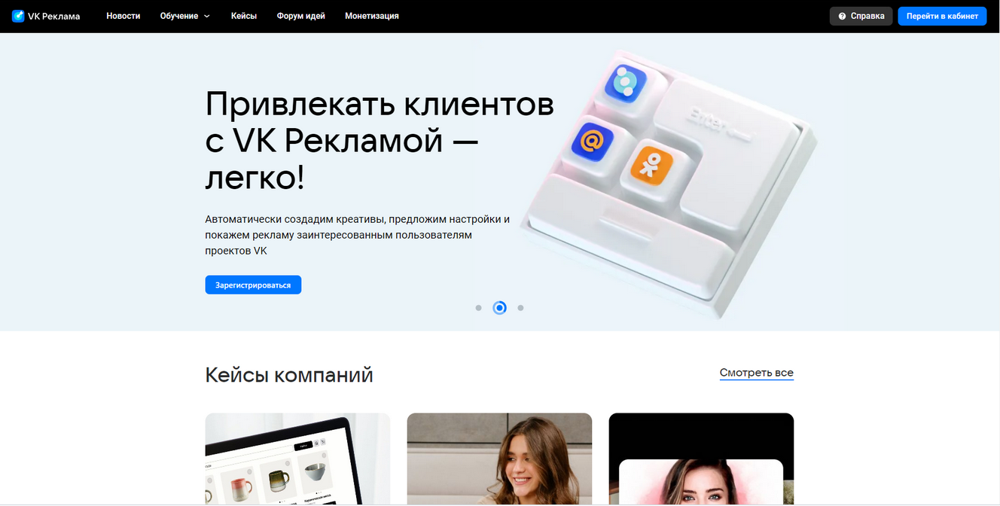

2. Тестирование вкладки "Обзор": 
   * При нажатии на кнопку "Обзор" в боковом меню, происходит перенаправление на URL: https://ads.vk.com/hq/overview и открывается следующее окно: 
   

3. Тестирование вкладки "Кампании":
   * При нажатии на кнопку "Кампании" в боковом меню, происходит перенаправление на URL: https://ads.vk.com/hq/dashboard/ad_plans и открывается следующее окно: 
   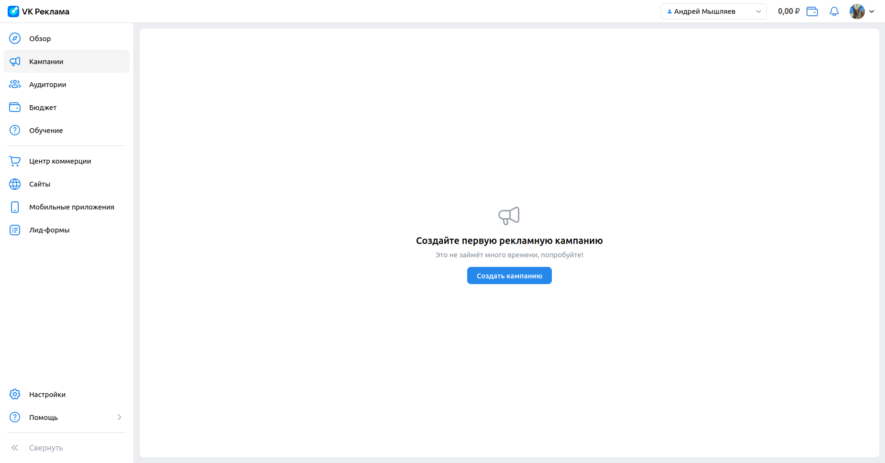

4. Тестирование вкладки "Аудитории":
   * При нажатии на кнопку "Аудитории" в боковом меню, происходит перенаправление на URL: https://ads.vk.com/hq/audience и открывается следующее окно: 
     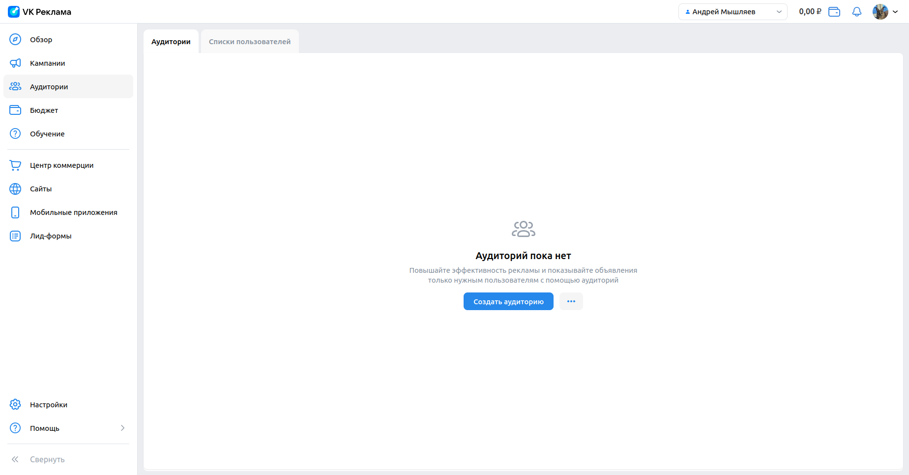

5. Тестирование вкладки "Бюджет":
   * При нажатии на кнопку "Бюджет" в боковом меню, происходит перенаправление на URL: https://ads.vk.com/hq/budget/transactions и открывается следующее окно: 
     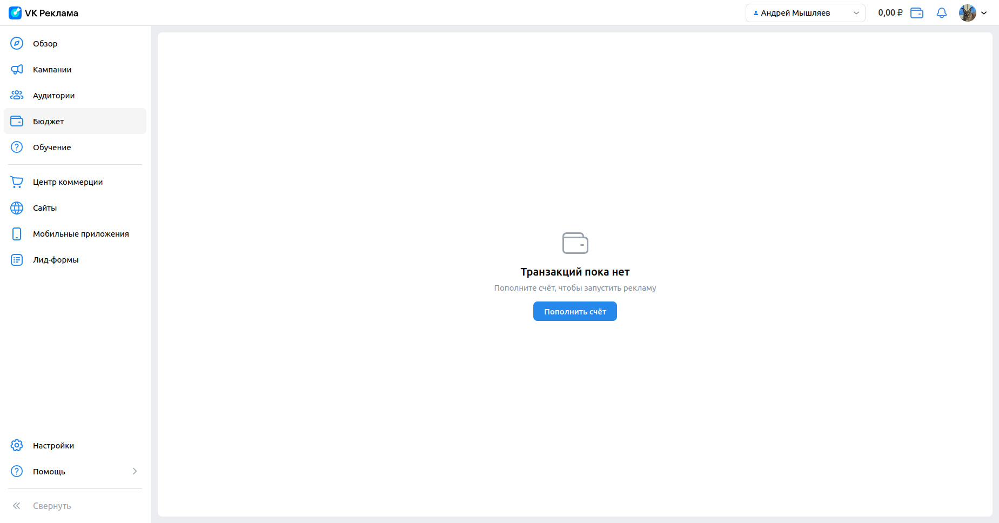

6. Тестирование вкладки "Обучение":
   * При нажатии на кнопку "Обучение" в боковом меню открывается следующее окно: 
     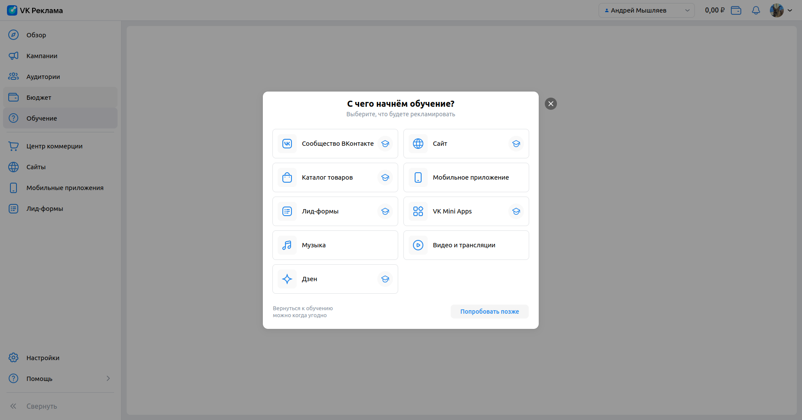

7. Тестирование вкладки "Центр коммерции":
     * При нажатии на вкладку "Аудитории" открывается страница аудиторий на https://ads.vk.com/hq/ecomm/catalogs
       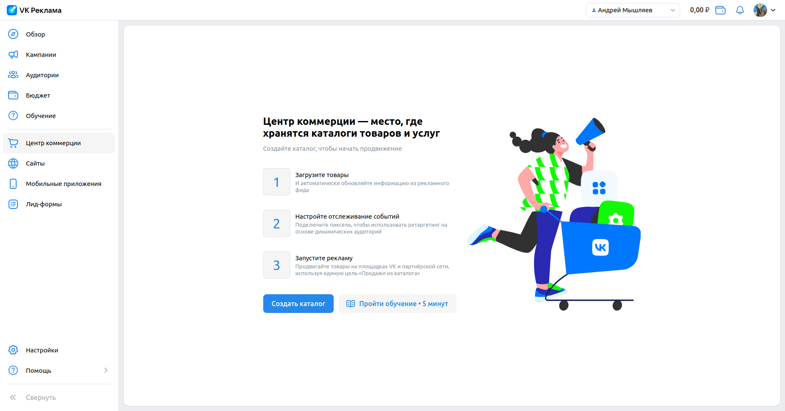
     * При нажатии на кнопку "Создать аудиторию" справа появляется боковое меню "Создание аудитории"
     * При нажатии на кнопку "Добавить источник" к боковому меню добавляется ещё одно меню "Включить источник"
     * При нажатии на вкладку "Ключевые фразы" окно "Включить источник" заменяется на меню "Ключевые фразы" с инпутами "Название", "Ключевые фразы", "Минус фразы", "Период поиска"
     * Кнопка "Сохранить" не активна если не заполнены текстовые поля "Ключевые фразы" или "Минус фразы"
     * При вводе в инпут "Период поиска" число меньше или равное 0, то через секунду оно автоматически заменится на 1
     * При нажатии на кнопку "Отмена" окно закрывается

8. Тестирование вкладки "Сайты":
   * При нажатии на кнопку "Сайты" в боковом меню, происходит перенаправление на URL: https://ads.vk.com/hq/pixels и открывается следующее окно: 
     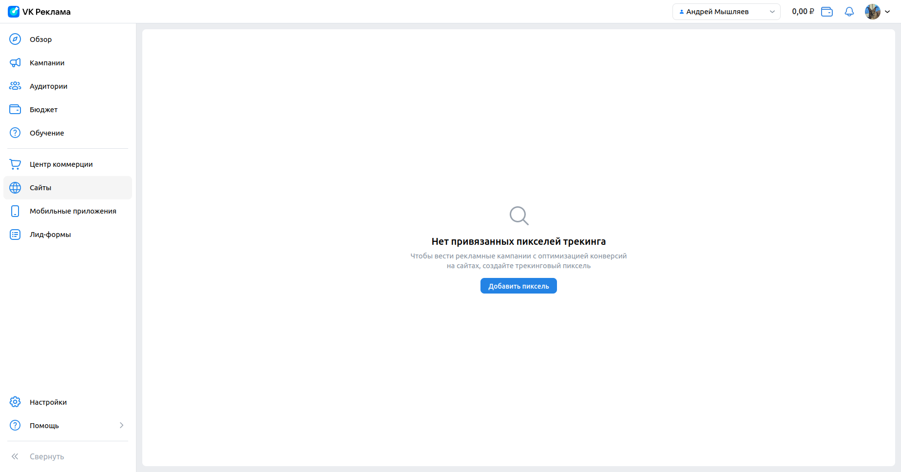

9. Тестирование вкладки "Мобильные приложения":
   * При нажатии на кнопку "Мобильные приложения" в боковом меню, происходит перенаправление на URL: https://ads.vk.com/hq/apps и открывается следующее окно: 
     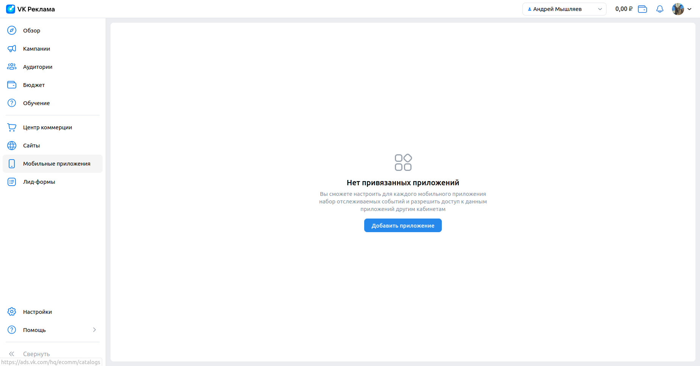

10. Тестирование вкладки "Лид-формы":
   * При нажатии на кнопку "Лид-формы" в боковом меню, происходит перенаправление на URL: https://ads.vk.com/hq/leadads/leadforms и открывается следующее окно: 
     
