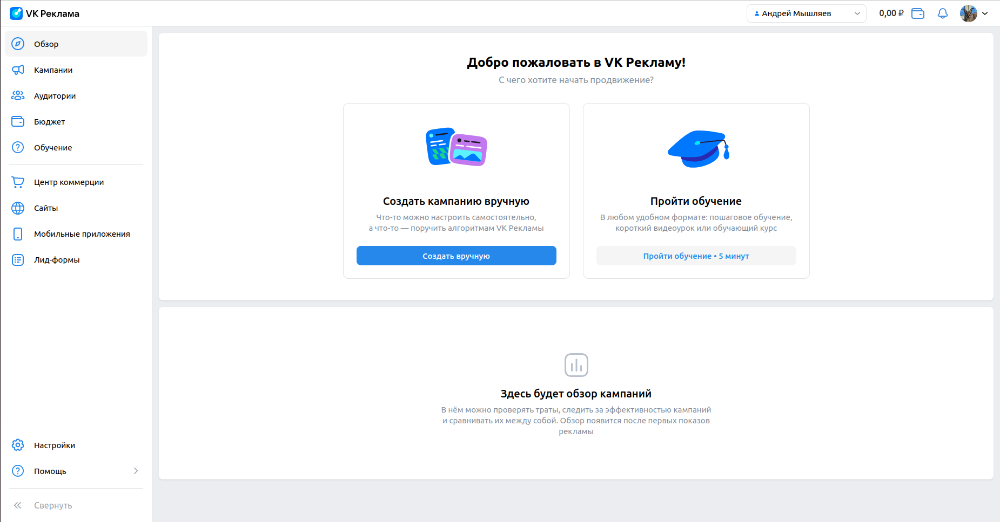
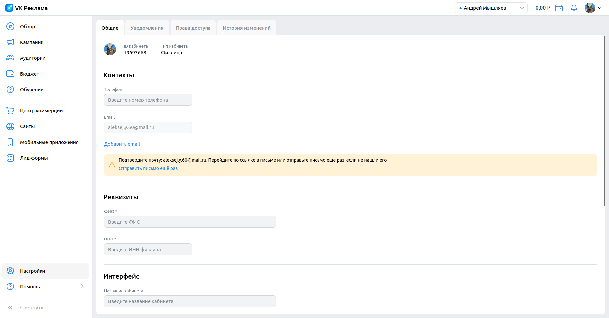
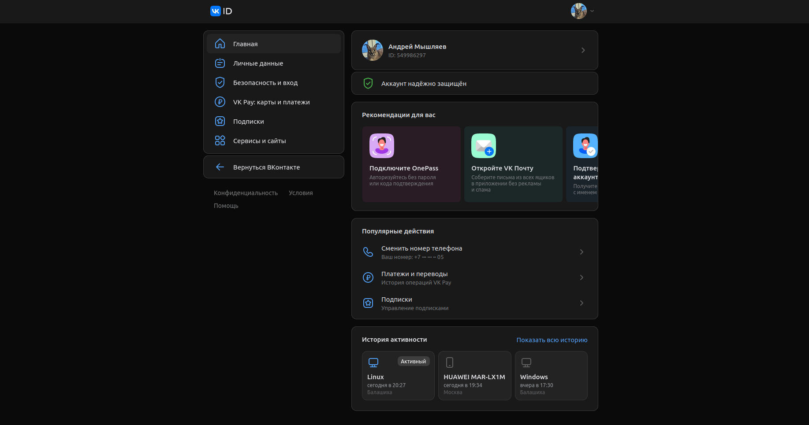
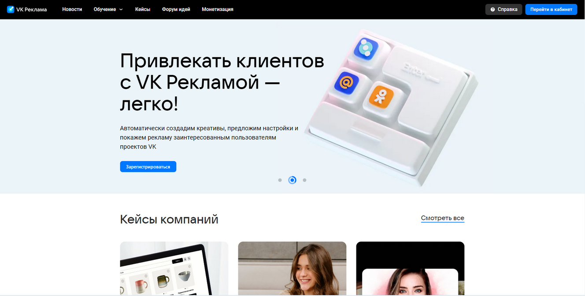
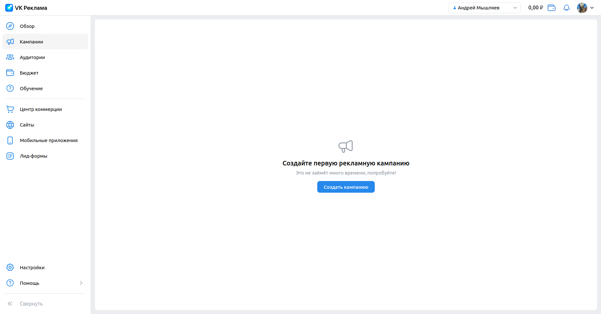
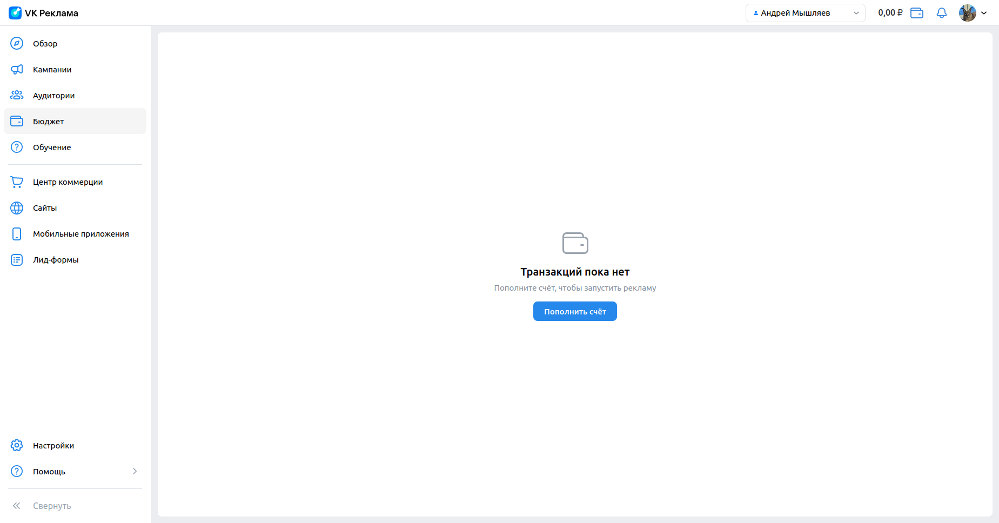
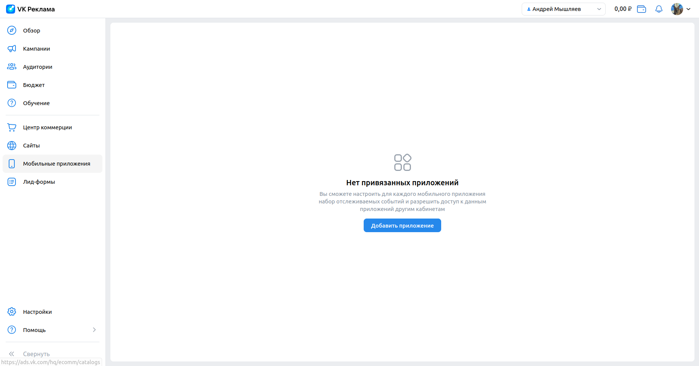

# Чек-листы ads.vk.com

## Личный кабинет - физическое лицо

1. Тестирование (навигационного) меню:
   * При успешной авторизации в аккаунт, происходит переход на URL: https://ads.vk.com/hq/overview и открывается следующее меню: 
   

   * При нажатии на иконку "VK Реклама", происходит переход на URL: https://ads.vk.com/hq/overview и открывается следующее меню: 
   
   
   * При нажатии на кнопку "Помощь", появляется дропбокс следующего содержания: "Кейсы компаний", "Справка", "Форум идей", "Задать вопрос". 
   

     * При нажатии на кнопку "Кейсы компаний" происходит перенаправление на URL: https://ads.vk.com/cases
     * При нажатии на кнопку "Справка" происходит перенаправление на URL: https://ads.vk.com/help/subcategories/agency
     * При нажатии на кнопку "Форум идей" происходит перенаправление на URL: https://ads.vk.com/upvote
     * При нажатии на кнопку "Задать вопрос" происходит перенаправление на URL: https://vk.com/im?media=&sel=-212221031

   * При нажатии кнопки "Настройки", происходит переход на URL: https://ads.vk.com/hq/settings и открывается следующее меню: 
   

       * При нажатии на вкладку "Уведомления" происходит перенаправление на URL: https://ads.vk.com/hq/settings/notifications
       * При нажатии на кнопку "Права доступа" происходит перенаправление на URL: https://ads.vk.com/hq/settings/access
       * При нажатии на кнопку "История изменений" происходит перенаправление на URL: https://ads.vk.com/hq/settings/logs

   * При нажатии на иконку пользователя происходит вызов следующего дропбокс меню, которое содержит имя пользователя с подпунктом "Управление VK ID", "Выйти": 
   
 
     * При нажатии на кнопку "Управление VK ID" происходит перенаправление на URL: https://id.vk.com/account/#/main
     
     
     * При нажатии на кнопку "Выйти" происходит выход из учетной записи и перенаправление на URL:https://ads.vk.com. 
     

2. Тестирование вкладки "Обзор": 
   * При нажатии на кнопку "Обзор" в боковом меню, происходит перенаправление на URL: https://ads.vk.com/hq/overview и открывается следующее окно: 
   

3. Тестирование вкладки "Кампании":
   * При нажатии на кнопку "Кампании" в боковом меню, происходит перенаправление на URL: https://ads.vk.com/hq/dashboard/ad_plans и открывается следующее окно: 
   

4. Тестирование вкладки "Аудитории":
   * При нажатии на кнопку "Аудитории" в боковом меню, происходит перенаправление на URL: https://ads.vk.com/hq/audience и открывается следующее окно: 
     

5. Тестирование вкладки "Бюджет":
   * При нажатии на кнопку "Бюджет" в боковом меню, происходит перенаправление на URL: https://ads.vk.com/hq/budget/transactions и открывается следующее окно: 
     

6. Тестирование вкладки "Обучение":
   * При нажатии на кнопку "Обучение" в боковом меню открывается следующее окно: 
     

7. Тестирование вкладки "Центр коммерции":
   * При нажатии на кнопку "Центр коммерции" в боковом меню, происходит перенаправление на URL: https://ads.vk.com/hq/ecomm/catalogs и открывается следующее окно: 
     

8. Тестирование вкладки "Сайты":
   * При нажатии на кнопку "Сайты" в боковом меню, происходит перенаправление на URL: https://ads.vk.com/hq/pixels и открывается следующее окно: 
     

9. Тестирование вкладки "Мобильные приложения":
   * При нажатии на кнопку "Мобильные приложения" в боковом меню, происходит перенаправление на URL: https://ads.vk.com/hq/apps и открывается следующее окно: 
     

10. Тестирование вкладки "Лид-формы":
   * При нажатии на кнопку "Лид-формы" в боковом меню, происходит перенаправление на URL: https://ads.vk.com/hq/leadads/leadforms и открывается следующее окно: 
     